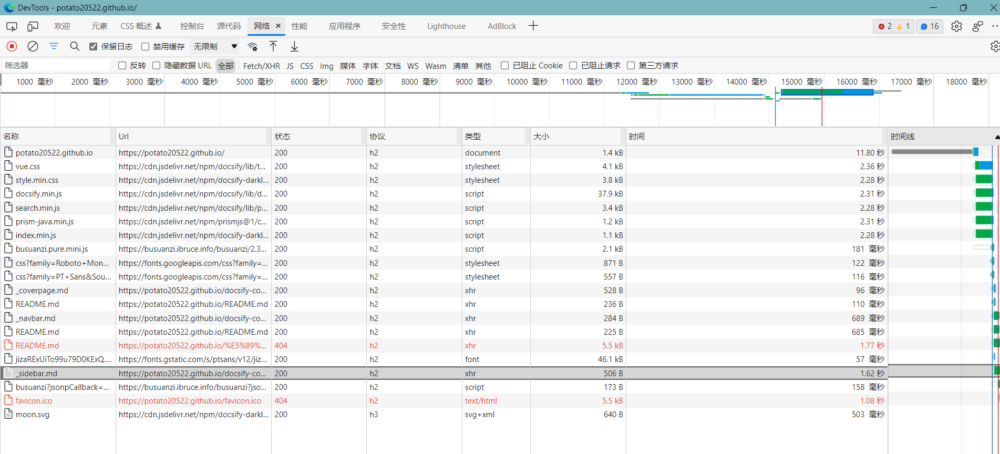

文档：https://docsify.js.org/#/zh-cn/

多个github pages部署在同一个docsify：[多项目部署在同一个GitHub Pages - 阿呜的边城 - 博客园 (cnblogs.com)](https://www.cnblogs.com/dev2007/p/13947333.html)

## jsdelivr CDN加速

加速前：1.62s

加速后：220ms

https://cdn.jsdelivr.net/gh/Potato20522/potato20522.github.io@master/docsify-config/_sidebar.md

